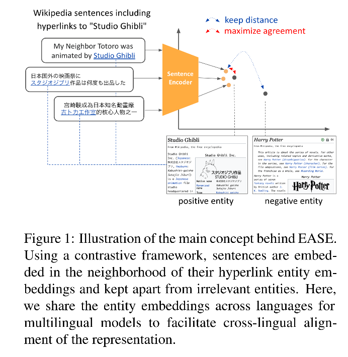

title: EASE: Entity-Aware Contrastive Learning of Sentence Embedding
booktitle: 2022 NAACL
code: https://github.com/studio-ousia/ease

# Motivation

采用句子中的实体信息进行对比学习，来学习sentence embedding。有以下两种好处：
1. 实体在很大程度上决定了句子的语意，因此在学习句子表示的过程中可以提供丰富有用的信息；
2. 实习的定义是独立于语种的，因此可以在为跨语言对齐上提供有用的信息。

# Method

提出一种新的有监督训练模式：entity hyperlink annotation (from Wikipedia)。使用的数据是来自Wikipedia，因此也有很多语种的平行语料。
这个训练模式包括两种训练目标：
1. entity contrastive learning (CL) loss：句子和其相关实体的。目的是将含有相关实体的句子的embedding拉近，含有不相关实体的句子拉远。
2. the self-supervised CL loss with dropout noise：我应该去拜读下SimCSE这篇，这边还参考了[1]。

## Contrastive Learning with Entities

## Hard Negative Entities

## Pretrained Entity Embeddings

## Self-supervised Contrastive Learning with Dropout Noise

# Experiment

## Monolingual

# reference
[1]Fast, effective, and self-supervised: Transforming masked language models into universal lexical and sentence encoders