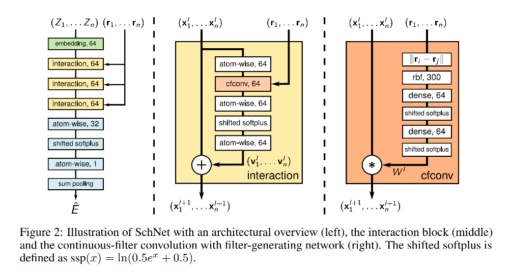

# SchNet

## Motivation 

好的，分子的3D信息很重要。化学空间很大，我们只需要带条件地探索就好。
并且，学习一个处于平衡状态的分子很重要。

## Method

### Continuous-filter convolutions

在cv领域得到广泛应用的卷积层，处理的数据还是离散的点。对于分子这种间隔不均匀的输入，如果需要用间隔一样的点去覆盖，那么会需要大量的点。还是有一些模型被提出解决这样的问题，本文提出的是使用continuous filter去处理不均匀的空间数据。定义如下：

有n个x的特征，将其表示为 $X^l=(x_1^l, ..., x_n^l)$ ，其中

### SchNet

# G-SchNet
2019nips的论文，感觉实验真的很水

