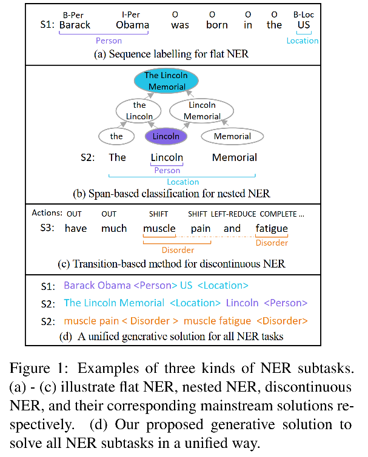
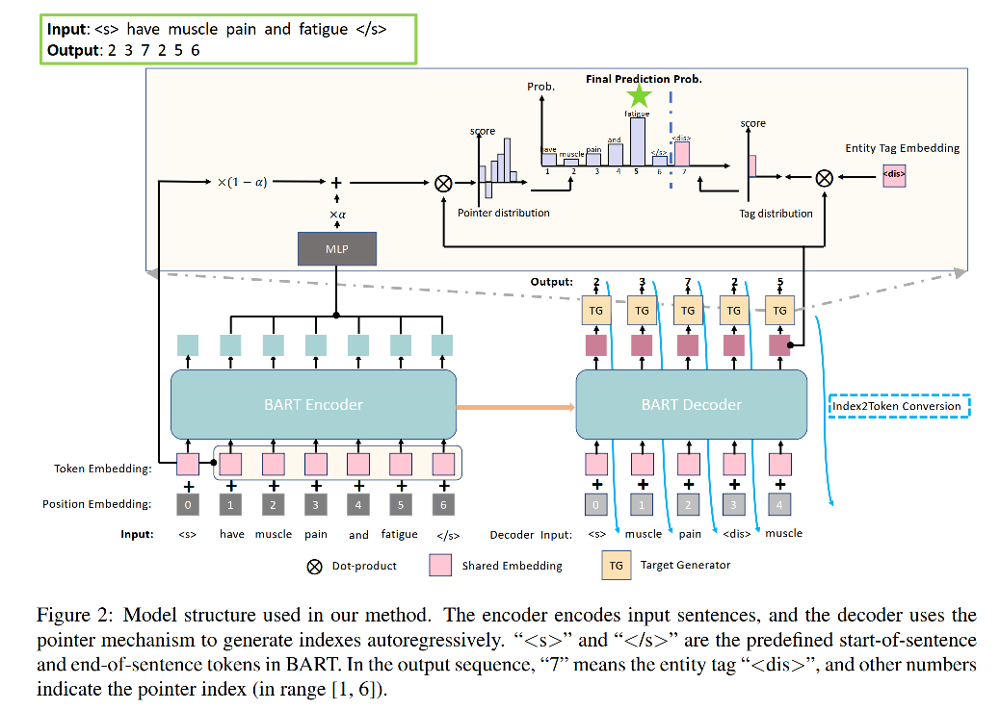

ACL 2021 A Unified Generative Framework for Various NER Subtasks

code：https://github.com/yhcc/BARTNER

# Motivation

命名实体识别可以继续细分成以下三个子任务：

1. flat NER
2. nested NER：实体中有实体
3. discontinuous NER：实体词在句子中不连续

以往解决 NER 任务用的方法是字符级别的序列标注或者对 text span 进行分类，但这些方法无法同时解决这三种子任务。

# Method

首先，我们需要将三种NER任务的输出统一，就能用seq2seq模型统一生成结果了，也能够运用预训练模型BART了。可以用entity pointer index sequence来表示文本中的实体和其位置。

